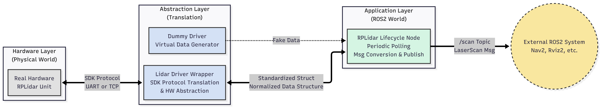

# Modern C++ RPLidar ROS2 Driver (Lifecycle & Threading)


An optimized, refactored ROS2 driver for Slamtec RPLidar series.
This project aims to solve the **"God Loop"** and **"Blocking I/O"** issues found in the official SDK.

## ✨ Key Features

* **Lifecycle Managed:** Fully supports `rclcpp_lifecycle` (Configure -> Activate -> Deactivate).
* **Non-Blocking I/O:** Decoupled data polling thread from the main ROS2 executor.
* **Modern Architecture:** 3-Layer Design (Node -> Wrapper -> SDK).
* **Dummy Mode:** Simulate lidar data without hardware (perfect for CI/CD).

## 🏗️ Architecture



## 🚀 Getting Started

### 1. Installation

```bash
mkdir -p ~/ros2_ws/src
cd ~/ros2_ws/src
git clone [https://github.com/frozenreboot/rplidar_ros2_driver.git](https://github.com/frozenreboot/rplidar_ros2_driver.git)
cd ..
colcon build --symlink-install
```

### 2. Usage (Quick Start via Launch)

The recommended way to run the driver. This handles parameter loading and lifecycle transitions automatically.

```bash
# 1. Setup Udev rules (Optional but recommended)
sudo chmod 777 /dev/ttyUSB0

# 2. Launch with auto-configure & auto-activate
ros2 launch rplidar_ros2_driver rplidar.launch.py
```

### 3. Usage (Manual Lifecycle Control)

If you want to control the lifecycle states manually:
```bash
# 1. Run the node (Starts in Unconfigured state)
ros2 run rplidar_ros2_driver rplidar_node --ros-args -p serial_port:=/dev/ttyUSB0

# 2. Trigger Lifecycle Transitions
ros2 lifecycle set /rplidar_node configure
ros2 lifecycle set /rplidar_node activate
```

### 4. Usage (Dummy Mode)

Running without hardware? No problem.
```bash
ros2 launch rplidar_ros2_driver rplidar.launch.py params_file:=$(ros2 pkg prefix rplidar_ros2_driver)/share/rplidar_ros2_driver/param/rplidar.yaml dummy_mode:=true
# Or simply set dummy_mode in the yaml file.
```


## 📊 Supported Devices
- RPLidar A1, A2, A3, S1, S2, S3... (Basically all models supported by Slamtec SDK)
    

## 📝 License

This project is licensed under the BSD-2-Clause License.

Original SDK copyright belongs to Slamtec Co., Ltd.